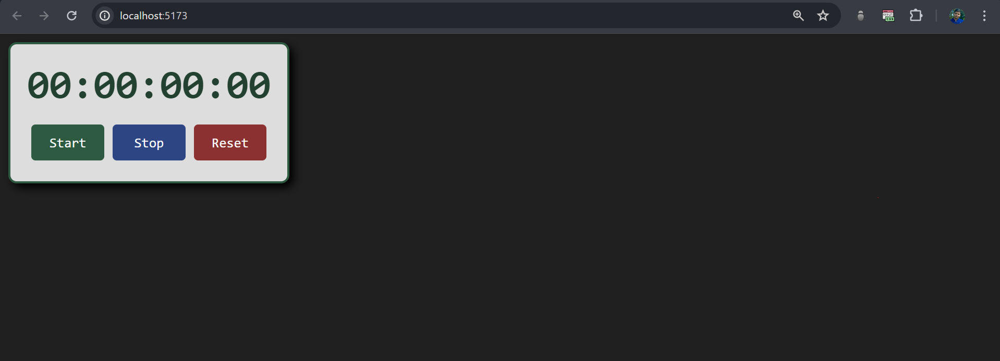

# Bro-Code Learning ReactJS

[Video Link](https://youtu.be/CgkZ7MvWUAA?si=S6yKIIdnOrdAkXYc)

## Index
- [How to set up react](#how-to-set-up-react)
- [Folder structure](#folder-structure)
- [Components](#components)
- [Adding CSS style to elements in ReactJS](#adding-css-style-to-element-in-reactjs)
- [Props](#props)
- [Conditional rendering](#conditional-rendering)
- [Rendering Lists](#rendering-lists)
- [Keeping Components Pure](#keeping-components-pure)
- [Click Events](#click---events)
- [React Hooks](#react-hooks)
- [useState](#use-state)
- [onChange - event handler](#onchange---event-handeler)
- [Making a color picker - mini project](#making-a-color-picker--mini-project)
- [Updater Function](#updater-function)
- [Update Objects in state](#update-objects-in-state)
- [Update Array/List Items in state](#update-arraylist-items-in-state)
- [Update Array Of Objects in state](#update-array-of-objects-in-state)
- [Todo App Project](#to-do-list-project)
- [Deploy react project](#deploy-react-project)
- [useEffect React Hook](#useeffect-react-hook)
- [Digital clock - Mini project](#digital-clock---mini-project)
- [useContext - hook](#usecontext---hook)
- [useRef - hook](#useref---hook)
- [StopWatch - Mini Project](#stopwatch---mini-project)

## Points 
- React works in JSX, which means JavaScript XML.
- React works with components.
- React components help in quick rearrangement of websites and solving repetition of elements


## How to set up react 
1. In the terminal, run `npm create vite@latest`.
2. Then project name, React, and JS.
3. `cd project-folder` and run `npm install`.
4. Then run `npm run dev` to open the server.


## Folder structure 
1. The `node_modules` contain all the dependencies our project has.
2. The `public` folder contains all public assets.
3. The `src` folder is the folder we will mostly use.
4. Inside `src`, `main.jsx` is the main JS of our project, and `app.jsx` is a component.
5. `index.html` is the main HTML of our project.
6. The `package.json` file contains metadata about our project.


## Components 
1. Components are the building blocks of projects.
2. We can build components by making a new `componentsName.jsx` within src.
- Example of Header components - 
```js
function Header(){

    return (
        <header>
            <h1>My App</h1>
        </header>
    );
}

export default Header;

```
3. Now we can import the header component within other components or our main `App.jsx` component like this:
- Component func name should start with uppercase letter like this - `Header`, `Profile`
```js
import Header from "./header.jsx";

function App() {
  return(
    <Header></Header>
  )
}

export default App

```
4. One component function can only return one HTML element, but we can add multiple child elements.
5. We can write a header like this also (shorthand):
```js 
<Header/>
```

6. Because JSX function only returns one component, it will give an error if we try to return two components.
7.To solve this, we can use JSX fragments` (<>...</>)` like this: 
```js
function App() {
  return(
    <>
        <Header/>
        <Footer/>
    </>

  )
}
```
8.If we want to add JS in component return statement, we use `{code}` like this:
```js
return (
        <footer>
            <p>&copy; {new Date().getFullYear()} Manik Maity</p>
        </footer>
    )
``` 

9. Outside return, we can use JS as usual like this:
```js
function Food (){
    const foods = ["Apple", "Banana", "Orange"];
    return (
        <ul>
            <li>{foods[0]}</li>
            <li>{foods[1]}</li>
            <li>{foods[2]}</li>
        </ul>
    )
}
```

10.We can use `className=""` to set classes in elements inside return. Because `class` is a reserved name.
```js
return (
        <div className="card">
            </img>
            <h2>Mnaik Maity</h2>
            <p>B.com (H) | I like development</p>
        </div>
    )
```


11. To use assets from the `assets` folder, we have to import that asset.
```js
import profilePic from "./assets/manik-maity.jpeg"
```
------------------------------------------

## Adding css style to element in reactjs
- External
- Internal
- Inline

### 1. External
- We can add style to an element in our `index.css` file.
- External stylesheet is mostly used to set global style.
- But it is not efficient in large web apps for naming and hard to maintain.
```css
.btn{
  padding: 7px 20px;
  background-color: rgb(103, 192, 247);
  color: white;
  border: none;
````

### 2. Module
- In this, we will create a dedicated CSS stylesheet specific to a component.
- We will create a dedicated file inside src for the component like `Button`.
- Make/Move the .jsx component like `button.jsx` inside that folder.
- Inside the folder ex - Button, we will make a stylesheet for the component named like `button.module.css`.
- Write the styling like this:

```css
/*file - button.module.css*/
.btn{
    padding: 7px 20px;
    background-color: rgb(103, 192, 247);
    color: white;}
```
- Then we import the stylesheet to our component .jsx file
```js
// file - button.jsx
import style from "./button.module.css";
```
- And we have to add the style classname from the imported style to the element className, like this:
```js
<button className={style.btn}>Click me</button>
```

### 3. Inline
- Inline CSS is used inside the component `.jsx` file by creating a style object.
- Then use the style object created in the element style attribute.
- It good for small element and minimum styling but not mantainable for complex styling
Ex. - 
```js
// ScondaryButton.jsx
const style = {
    padding: "7px 20px",
    color: "white",
    backgroundColor : "transparent",
    fontWeight: "bold",
    marginTop: "5px",
    cursor: "pointer",
    border : "1px solid #67c0f7",
}

function SecondaryBtn(){
    return (
        <button style={style}>About</button>
    )
}

export default SecondaryBtn;
```

## Props 
- These are read-only properties that are shared between components. A parent component can send data to a child component.
- To use props, we have to pass props as a parameter for the component function. And we can use props' values in HTML.

```js
function student(props) {
    return (
        <div>
            <p>Name: {props.name}</p>
        </div>
    );
}
```
- We can set props value in the parent component like this:
```js
function App() {
  return(
    <>
      <Student name="Manik"/>
    </>
  )
}
```
- Besides strings, if we want to set value we have to use `{}` to pass value like this:
```js
    <>
      <Student name="Manik" age={20} isStudent = {true}/>
    </>
```

- We can just change the props value to make different HTML elements like this:
```js
    <>
      <Student name="Manik" age={20} isStudent = {true}/>
      <Student name="Suman" age={14} isStudent = {true}/>
      <Student name="Ronit" age={21} isStudent = {true}/>
      <Student name="Swapan" age={45} isStudent= {false}/>
    </>
```

### Prop Types -
- It is a mechanism to check the passed props value is required data type.
- It is good practice to use prop types.
- We have to import `prop-types` from the node module to the child component .jsx file.
```js
import propTypes from "prop-types";
```

- Then we can set prop type after the component function like this -
```js
import propTypes from "prop-types";

function student(props) {
    return (
        <div className="studentCard">
            <p>Name: {props.name}</p>
            <p>Age : {props.age}</p>
            <p>{props.isStudent? "He is a student" : "He is not a student"}</p>
        </div>
    );
}

student.propTypes = {
    name : propTypes.string,
    age : propTypes.number,
    isStudent : propTypes.bool
}

export default student;
```
- Wrong prop type will not prevent the code from running. It will just give a warning in console.

### Default props -
- We can pass props, add them to the JSX, just like we would with HTML attributes.

**Old way of setting default -**
```js
import propTypes from "prop-types";

function student(props) {
    return (
        <div className="studentCard">
            <p>Name: {props.name}</p>
            <p>Age : {props.age}</p>
            <p>{props.isStudent? "He is a student" : "He is not a student"}</p>
        </div>
    );
}

student.defaultProps = {
    name : "Student",
    age : "Null"
}

export default student;
```

**New way of declairing default -**
```js
// we just destructured the props obj to {url, size}
export default function ProfileImg({url = "https://picsum.photos/200/300", size = 100}){
    return (
        
    )
}
```

## Conditional rendering
 - We can conditionally render JSX using JavaScript syntax like `if` statements,` &&, and ? :` operators.

 ### Using if else
 ```js
 function UserGreeting ({username = "User", isLogedIn = false}){
    if (isLogedIn){
        return (
            <h1>Hi🙏, {username}.</h1>
        )
    }
    else{
        return (
            <h1>Please log in {username} 🙏.</h1>
        )
    }
}
 ```

 ```js
    <UserGreeting username="Manik" isLogedIn = {false}/> //output - Please log in Manik 🙏.
    <UserGreeting  isLogedIn = {true}/> // Hi🙏, User.

 ```

### using ternary operator
```js
return (
        isLogedIn ? <h1>Hi, {username}.</h1> : <h1>Please log in.</h1>
    )
```

**We can make the code more readable by storing the elements in a constant like this** 
```js
const welcomeEle =  <h1 className="user-message">Hi, {username}.</h1>;
    const logInEle = <h1 className="login-message">Please log in.</h1>;
    
    return (
        isLogedIn ? welcomeEle : logInEle
    );
```


## Rendering Lists
- We can loop through array data and can make list items.
- To render all components we use `map()`.
- To render specific items we use `filter()`.


### Render all list items - map()

```jsx
function List({arr = []}){
    const listItems = arr.map((text) => <li>{text}</li>);
    return (
        <ul>
            {listItems}
        </ul>
    );
}
```
```js
function App() {
  
 const names = [
  'Creola Katherine Johnson: mathematician',
  'Mario José Molina-Pasquel Henríquez: chemist',
  'Mohammad Abdus Salam: physicist',
  'Percy Lavon Julian: chemist',
  'Subrahmanyan Chandrasekhar: astrophysicist'
];

const peoples = [{
  id: 0,
  name: 'Creola Katherine Johnson',
  profession: 'mathematician',
}, {
  id: 1,
  name: 'Mario José Molina-Pasquel Henríquez',
  profession: 'chemist',
}, {
  id: 2,
  name: 'Mohammad Abdus Salam',
  profession: 'physicist',
}, {
  id: 3,
  name: 'Percy Lavon Julian',
  profession: 'chemist',  
}, {
  id: 4,
  name: 'Subrahmanyan Chandrasekhar',
  profession: 'astrophysicist',
}];

  return(
    <>
      <List arr={names}/>
    </>
  )
}
```


### Filtering arrays of items  - filter()
- To filter array and render them in list we firstly have to use `.filter()` method to filter out desired array items.
- Then we can use `.map()` to render filtered array to html like previously.


```jsx 
function FilteredList({array = [], filterItem = ""}){
    let filterdArray = array;
if (filterItem){
     filterdArray = array.filter(person => person.profession == filterItem);
}
    // eslint-disable-next-line react/jsx-key
    const listItems = filterdArray.map(person =>  <li>
        
        <p>
          <b>{person.name}:</b>
          {' ' + person.profession + ' '}
          known for {person.accomplishment}
        </p>
      </li>);

    return (
        <ul>
            {listItems}
        </ul>
    )
}

export default FilteredList;
```
```js
 <FilteredList array={people} filterItem="chemist"/>
```

**Keeping list items in order with key-**
- We have to set a unique key for each array item
- It helps in inserting and deleting specific items.
- It will remove the warning in console.

```js
//key 
const listItems = filterdArray.map(person =>  <li key={person.id}>
        
        <p>
          <b>{person.name}:</b>
          {' ' + person.profession + ' '}
          known for {person.accomplishment}
        </p>
      </li>);
```

## Keeping Components Pure

### Pure function
- Don't change any object or variable
- In the same input it gives the same output.
- Below func is a pure function if we pass 2 it will give 4, if 3 passed it gives 6

```js
function double(number) {
  return 2 * number;
}
```

### Unpure function 
- Calling this component multiple times will produce different JSX!
```js
let i = 0;
function Unpure (){
    i++;
    return (
        <h1>This is a unpure function for Recatjs {i}</h1>
    );
}
export default Unpure;
```
- Instead of an impure function we can use props to get the same result but predictable.
```js
function Pure ({num = 0}){
    return (
        <h1>This is a pure function #{num}</h1>
    );
}
export default Pure;
```

## Click - events
- Click events are like event listener in react;
- We can set a click event to an element by using `onClick` and other events like `onDoubleClick`;
- We have to declare the event function inside .jsx component function and set it to the element like this -

```js
function SecondaryBtn(){
    const changeName = (e) => {
        e.target.innerText = "Its works🙀";
        e.target.style.backgroundColor = "darkgreen";
    }
    return (
        <button onClick={changeName} className="secondaryBtn">About</button>
    )
}
```

- we can pass arguments to the event function like this - put the function inside another func
```js
return (
        <button onClick={(e) => {getTime(e, "time")}} className="secondaryBtn">Click me😸</button>
    )
```

### Click events extra - from react.dev
- We can pass the child elements' event function as a prop.
```js
import style from "./button.module.css";
function Button ({lightMode}){

    return (
        <button onClick={(e) => {
            e.stopPropagation();
            lightMode()
        }} id="My-btn" className={style.btn}>Click me</button>
    )
}
export default Button;
```

## React hooks
- Hooks allow function components to have access to state and other React features.
- Examples of react hooks are useState, useEffect, useContext, useReducer, useCallback, etc.


## Use State 
- Using useState, we can make variables that, when updated, will update the virtual DOM too.
- Normal variables when updated don't show in the DOM react.

### How to use 
- We have to make a function-based component.
- We have to import specific hooks needed from the React library.
```js
    import { useState } from "react";
    
    function MyComponent (){
      return (
        <h1>HI</h1>
      )
    }

    export default MyComponent;
```

- then have to useState() method incide the function which return a array.
- we have destructured the array to a vaibale ex- `name` and a function ex- `setName`.
- we can pass initial value in useSate(initial value).
- in my case `name` store the variable and `setName`method update the variable.
```js
function MyComponent() {

    let [name, setName] = useState('Manik');
    const names = ["Suman", "Swapan", "Tapan", "User"];

    const changeName = () => {
        let newName = Math.floor(Math.random()*4);
        name = names[newName];
        setName(name);
        console.log(name)
    }

    return (
    <div style={style}>
         <h1>Hi, {name}</h1>
         <Button func={changeName}/>
    </div>
   
);
}
export default MyComponent;
```

## onChange - event handeler 
- This event captures the changes in an Input Field and executes the handler function.
- Mostly used in input, textarea, select, radio.
- To use onChange event, we have to use useState to make a variable.
```js
    let [name, setName] = useState("cake");
```
- Then we will make a function which sets the `e.target.value` to update the state variable.
```js
    const handleNameChange = (e) => {
        setName(e.target.value);
    }
```
- We will pass this function to the `onChange` attribute of our input element.
```js
    <input value={name} onChange={handleNameChange}/>
    <h2>Name: {name}</h2>
```

- Different input elements have different logic to use onChange with state.


## Making a color picker- mini project

### Code
```jsx
import { useState } from "react";
import ReuseButton from "./ReuseButton.jsx";

function ColorPicker() {
  const [color, setColor] = useState("#000000");

  const style = {
    backgroundColor: color,
    border: "none",
    border: "1px solid #fff",
  };

  const handleColorChange = (e) => {
    setColor(e.target.value);
  };

  const randomHexCode = () => {
    let hexCode = Math.floor(Math.random() * 16777215).toString(16);
    setColor(`#${hexCode}`);
  };

  return (
    <div className="card">
      <h2>Color Picker</h2>
      <div className="color" style={style}>
        <p>{color}</p>
      </div>

      <div className="picker-control">
        <input
          type="color"
          onChange={handleColorChange}
          value={color}
          id="colorSelect"
        />
        <ReuseButton func={randomHexCode} text="Random?" style={style} />
      </div>
    </div>
  );
}

export default ColorPicker;
```
### Output
<video width="100%" controls>
  <source src="../readmeAssets/WhatsApp Video 2024-05-03 at 19.44.30_bc0c1ce7.mp4" type="video/mp4">
  Your browser does not support HTML video.
</video>

## Updater Function
- In React, an updater function is a function that is passed as an argument to the `setState()` function.
- It is used to update the previous state, and it is also used for multiple state updates and async functions.
- It is a best practice.

```js
const [count, setCount] = useState(0);

    function incrementCount () {
        setCount(count + 1);
        setCount(count + 1);

    }
```
- In this case, you might think `incrementCount` will update the state + 2.
- But it will not because React doesn't update immediately, so only +1.
- That's why we need an updater function, it's an arrow function.
```js
function incrementCount () {
        setCount(c => c + 1);
        setCount(c => c + 1);
    }
```
- This will work now. Named `c` because it is the first letter of the `count` variable. And `c` represents the previous `count`, not the current.

## Update Objects in state
- Firstly, we will make a state object variable.
```js
  const [car, setCar] = useState({
    year: 2024,
    make: "ford",
    model: "Mustang",
  });
```
- But if we want to change the year from input field using onChange func like this -
```js
function handleYearChange (e) {
    setCar({year : e.target.value});
  }
```
```js
<input type="number" value={car.year} onChange={handleYearChange}/>
```
- It will set a new object `{ year: value }` to the state variable. So, `make` and `model` will be removed.
- Because of this, we have to use the spread operator `{...obj}` like below to set value -
```js
function handleYearChange (e) {
    setCar({...car, year : e.target.value});
  }
```
- This will set the variable to a new object where only the year value changed.
- We can change this to an arrow function for best practices.
```js
function handleYearChange (e) {
    setCar(c => ({...car, year : e.target.value}));
  }
```

## Update Array/List Items in state
- First, we make a useState hook with an initial array.
```js
const [todo, setTodo] = useState(["First todo"]);
```
- Then make list items from that array
- `map` automatically takes two parameters: item and its index.
```js
let listItemHtml = todo.map((item, index) => <li className="todo-item" onDoubleClick={() => handleDeleteItem(index)} key={index}>{item}</li>)
```
- To add items to the array, we can use the `spread operator` as we did with objects.
```js
 const handleAddTodo = (e) => {
        e.preventDefault();
        const inputBox = document.getElementById("todoInput");
        const inputBoxValue = inputBox.value;
        if (inputBoxValue != ""){
            setTodo(t => [...todo, inputBoxValue]);
            inputBox.value = "";
        }
    }

```

```js
const handleDeleteItem = (i) => {
    setTodo(t => (todo.filter((item, index) => index != i)));
  }
```

## Update Array Of Objects in state
- To update an array of objects, we will make a state variable with an empty array.
```js
    const [phones, setPhones] = useState([]);
```
- Then we have to make a state variable for each key of the array like this -
```js
    const [year, setYear] = useState(new Date().getFullYear());
    const [brand, setBrand] = useState("");
    const [model, setModel] = useState("");
```
- Now we can update the key state variable value if we want (ex- in onChange)-
```js
const handleChangeYear = (e) => {
    setYear(e.target.value);
}   
```
- From the key state value, we can add a new object to the object array using set and spread on the event -
```js
const handleAddPhone = () => {
    if (year != "" && brand != "" && model != ""){
        const newPhone = {
            brand : brand,
            model : model,
            year : year
        }
        setBrand("");
        setYear(new Date().getFullYear());
        setModel("");
        setPhones(p => [...phones, newPhone]);

    }
}
```

- Made add phone list mini project - adding and deleting an array of obj functionality

## To Do List project

### Issue 1 solved - 
#### Issue:
Deleting tasks doesn't update localStorage correctly. One deletion may not reflect, and refreshing after deleting multiple tasks often leaves one task undeleted.

#### Explanation:
Due to asynchronous state updates, localStorage updates might occur before the state fully updates, resulting in incorrect data storage.

#### Solution:
Call the localStorage update within the `setTasks` callback to ensure it operates on the updated state.

```js
const handleDeleteTask = (i) => {
    setTasks(prevTasks => {
        const updatedTasks = prevTasks.filter((_, index) => index !== i);
        updateLocalStorage(updatedTasks);
        return updatedTasks;
    });
}
```
### Issue 2 solved - 

#### Issue -
How to rearrange tasks by moving them up and down using "👆" and "👇" buttons.

#### Solution - 
- Used spread operator to copy all task array.
- Then used array destructuring to reposition the array item with its neighboring item.
#### For Up
```js
const handleTaskUp = (i) => {
    if (i > 0){
        let updatedTasks = [...tasks];
        [updatedTasks[i], updatedTasks[i - 1]] = [updatedTasks[i - 1], updatedTasks[i]] //repositioned
        setTasks(precTask => {
            updateLocalStorage(updatedTasks)
            return updatedTasks;
        });
    }
}
```

#### For Down 
```js
const handleTaskDown = (i) => {
    if (i < tasks.length - 1){
        let updatedTasks = [...tasks];
        [updatedTasks[i], updatedTasks[i + 1]] = [updatedTasks[i + 1], updatedTasks[i]] //repositioned
        setTasks(precTask => {
            updateLocalStorage(updatedTasks)
            return updatedTasks;
        });
    }
}
```

### Todo app code here - [Todo.jsx](./website/my-react-app/src/TodoList.jsx)
### Todo app live website here - [Live website](https://todoapp-react-manik.netlify.app/)

## Deploy react project
- To deploy a react project, run `npm run build` in the terminal.
- This will convert our whole react project to HTML, CSS, and JS code files.
- This will create a `dist` folder with code files and assets inside.
- We can deploy the `dist` folder on Netlify manually to deploy the project.

## useEffect React Hook
- The useEffect Hook allows you to perform side effects in your components.
- For example, useEffect does some codes when the component re-renders, when state value changes, etc.
```js
useEffect(<function>, <dependency>)
```
### Uses 
- DOM Manipulation
- Event listener
- Subscriptions (real-time updates)
- Fetching data from API
- Cleanup on unmounting the component.

**Mounting** - Adding a component to the DOM.
**Unmounting**  - Removing a component to the DOM.

### useEffect Explanation - 
- Firstly, we have to import the useEffect from react.
```js
import { useEffect, useState } from "react";
```
- Then we can use useEffect inside our component function like this:
```js
  useEffect(() => {
    document.title = `Count ${count}`;
  });
```
- Above code will change the website title whenever count updates.
- We can set dependencies by passing an array after the `callback` inside `useEffect`.
- If we pass `[]` an empty array, that means the useEffect callback runs only once.
```js
  useEffect(() => {
    document.title = `Count ${count}`;
  }, []);
```
- If we pass count inside that array, that means useEffect callback only runs if count inside the array changes.
- That is why in the below code the title will not update on change color even we pass color inside the callback:
```js
  const [count, setCount] = useState(0);
  const [color, setColor] = useState("#317a4c")

  useEffect(() => {
    document.title = `Count ${count}, Color ${color}`;
  }, [count]);

  const changeColor = () => {
    setColor(c => c == "#317a4c" ? "#453461" : "#317a4c");
  }
```
- But if we pass the color in the useEffect array, the title will update on change color.
```js
  useEffect(() => {
    document.title = `Count ${count}, Color ${color}`;
  }, [count,  color]);

```

### Mini project - windown resize text
- If we just add the event listener inside the component function, it will add the same event listener many times whenever the component re-renders.
```js
    window.addEventListener("resize", () => {
        changeSize();
        console.log("event listener added")
    })

    function changeSize () {
        setHeightSize(window.innerHeight);
        setWidthSize(window.innerWidth)
    }
```

- That's why we can add the event listener inside the useEffect with a cleanup function like this:
```js
useEffect(() => {
        window.addEventListener("resize", changeSize);
        console.log("Added event")

        return () => {
            window.removeEventListener("resize", changeSize);
            console.log("event removed")
        }
    }, [])

    function changeSize () {
        setHeightSize(window.innerHeight);
        setWidthSize(window.innerWidth)
    }
```


- The cleanup return function will run when we unmount the component.
- [Resize Component mini project](./website/my-react-app/src/ResizeText.jsx);

## Digital clock - Mini project
- [Code Here](./website/my-react-app/src/Clock.jsx);

### In useEffect hooks section - I didnt fully understood cleanup function.

## useContext - hook
- It can be used together with the useState Hook to share state between deeply nested components more easily than with useState alone.
- Because of this, we don't have to pass props to access parent and child component values.

### Explanaton with example
- If we make box div components nested inside each other from `ComponentA` to `ComponentD` like this:
<hr>

- if we make a state variable in `ComponentA` for the user and want that variable in `ComponentD`.

```js
const [user, setUser] = useState("Manik");

    return (
        <div className="box">
            <h1>Component A</h1>
            <h2>{`Hello ${user}`}</h2>
            <ComponentB/>
        </div>
    )
```
- **We have two ways to do that :**
1. Using props - 
- We have to pass the variable by props from each component `a -> b -> c -> d`
```js
function ComponentD ({name}){
    return (
        <div className="box">
            <h1>Component D</h1>
            <h2>{name}</h2>
        </div>
    )
}
```
- Passing props each component like this is called props drilling.

2. Using useContext hook -
- useContext hooks help us to share values between deeply nested components more easily than props.
- Firstly, we have to go to the value provider component and import createContext from react.
```js
import { useState, createContext } from "react";
```
- Then we have to create a variable for createContext outside the component function and export it.
```js
export const UserContext = createContext();

```
- Then we have to wrap the required children components within the below special provider component made using the context variable we made like this.
```js
return (
        <div className="box">
            <h1>Component A</h1>
            <h2>{`Hello ${user}`}</h2>

            // special provider component
            <UserContext.Provider value={user}>
                <ComponentB/>
            </UserContext.Provider>
            
            <button onClick={changeName}>Change</button>

        </div>
    )
```

- After that, we will go to the child component where we want the provider/parent component value.
- We have to import useContext from react and the context variable we made from the provider (parent) component.
```js
import { useContext } from "react";
import { UserContext } from "./ComponentA.jsx";
```
- Then we have to create a variable with useContext and imported context from the provider inside the component function like this:
```js
import { useContext } from "react";
import { UserContext } from "./ComponentA.jsx";

function ComponentD (){

// making variable
    const user = useContext(UserContext);

    return (
        <div className="box">
            <h1>Component D</h1>
            //using that variable
            <h2>{user}</h2>
        </div>
    )
}

export default ComponentD;
```
<hr>


- We can get the provider value inside any and inside as many childrens using the same method.

## useRef - hook
- The useRef Hook allows you to persist values between renders. It can be used to store a mutable value that does not cause a re-render when updated. It can also be used to access a DOM element directly.
- It stores a value like useState but doesn't re-render on value change.

### Need 
- We can use useState but useState re-renders the component every time the state value changes. We can see in this example:
```js
    const [num, setNum] = useState(0);
    useEffect(() => {
        console.log("Render");
    })

    return (
        <div className="card">
            <button onClick={() => {setNum(n => n + 1)}}>Click {num}</button>
        </div>
    )
```
- The useEffect will print "Render" when the component re-renders.
- That's why we have to use useRef.

### How to use 
- We have to make a constant with `useRef` function like this inside the component function:
```js
const ref = useRef();
```
- useRef returns an object with one property `current`, and we can set `current` by passing a value in the useRef function:
```js
function UseRefExample (){
    const ref = useRef(0);
    useEffect(() => {
        console.log("Render");
    })
    return (
        <div className="card">
            <button onClick={() => {ref.current++; console.log(ref.current)}}>Click</button>
        </div>
    )
}

```
- Now when we click the button, the ref value changes and prints, but the component does not re-render.
- We can use useRef to store any HTML element like this by passing null initially in the useRef method, then using the ref attribute to the constant created in the HTML element:

```js
const input = useRef(null);
return (
        <div className="card">
            <input type="text" name="" id="" ref={input}/>
            <button>Click</button>
        </div>
    )
```
- Now we can change the ref input to change the HTML element without re-rendering.
```js
// Chnage the input bgcolor to green and give focus without component re-render.
const handleClick = () => {
        input.current.focus();
        input.current.style.background = "lightgreen";
    }

    return (
        <div className="card">
            <input type="text" name="" id="" ref={input}/>
            <button onClick={handleClick}>Click</button>
        </div>
    )
````

## StopWatch - Mini Project
- ### [Stop Watch Component Code](./website/my-react-app/src/StopWatch.jsx)
- ### Preview

